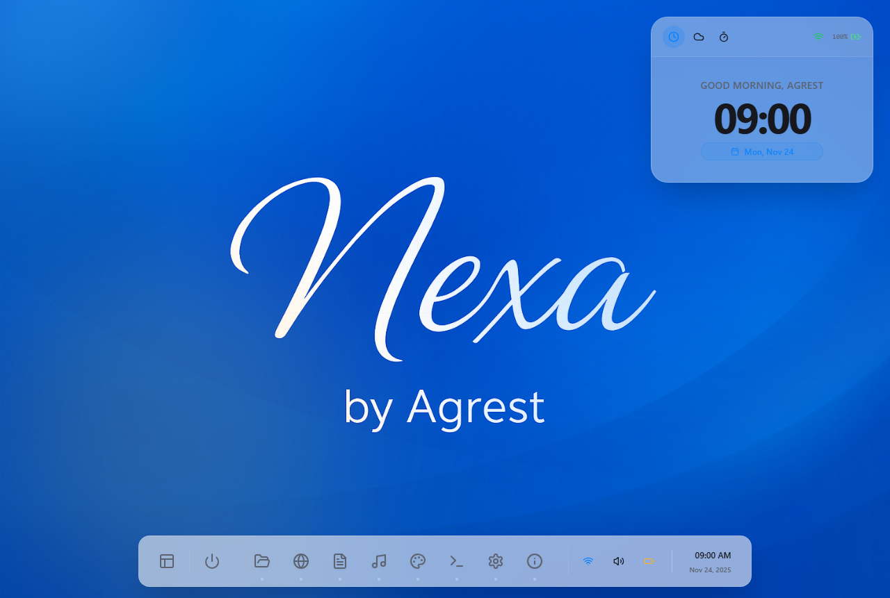
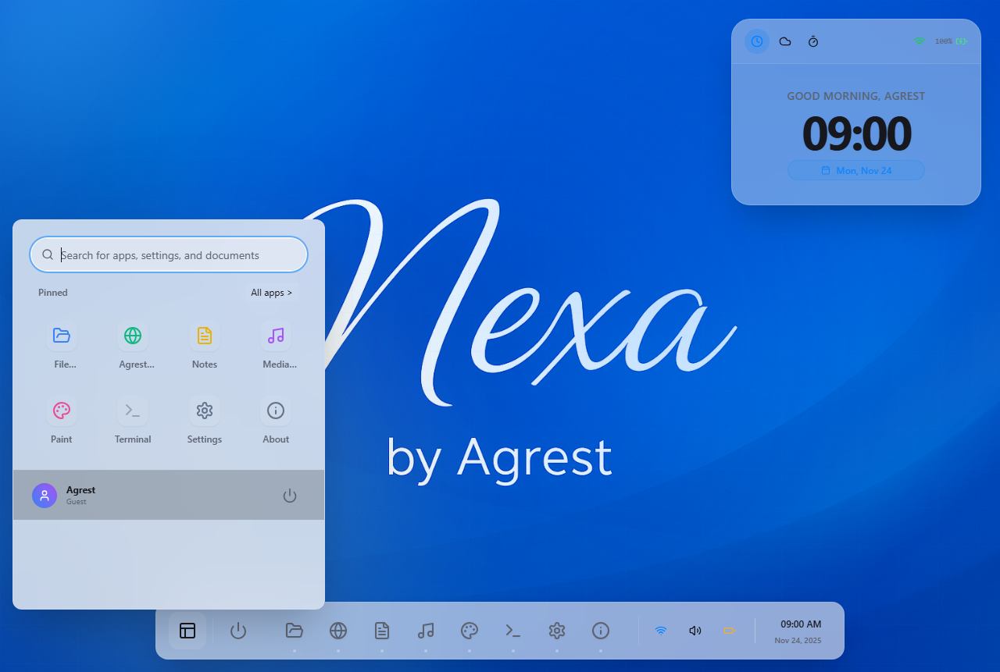
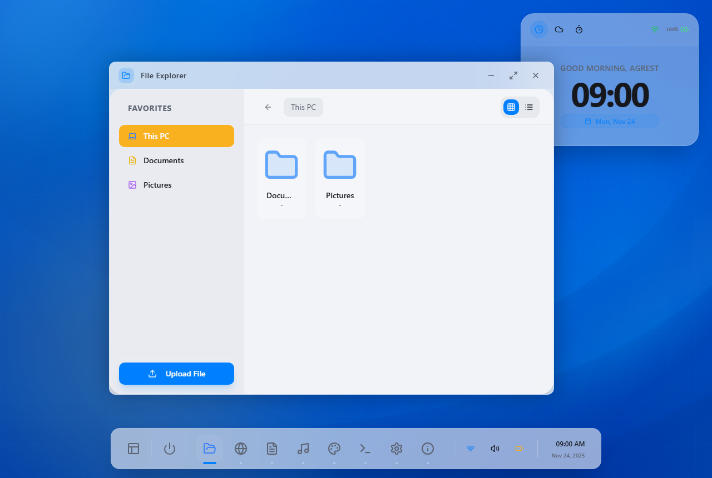
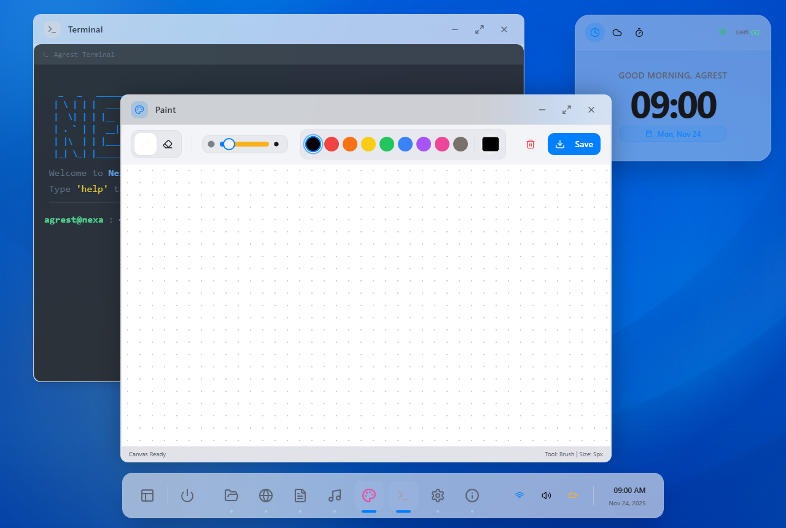

# Nexa OS 🌐💻

> **A fully functional, web-based operating system simulation built with React & TypeScript.**  
> *Experience the fluidity of a desktop environment, right inside your browser.*

[](LICENSE)
[](https://reactjs.org/)
[](https://www.typescriptlang.org/)
[](https://tailwindcss.com/)

---

## 🚀 Overview

**Nexa OS** is not just a portfolio website; it's a testament to what modern web technologies can achieve. It simulates a complete desktop experience with window management, a virtual file system, and native-like applications, all running client-side.

This project showcases advanced frontend development skills, including complex state management, persistent storage (IndexedDB), and immersive UI/UX design using Glassmorphism principles.

---

## ✨ Key Features

### 🖥️ Core Experience
- **Boot Sequence:** Realistic startup animation with BIOS-like logs and a secure Lock Screen.
- **Window Manager:** Drag, drop, resize, minimize, and maximize windows with buttery-smooth physics.
- **Taskbar & Start Menu:** Fully interactive dock with active app indicators and a searchable Start Menu.
- **Theme System:** Automatic Dark/Light mode detection with persistent user preference.

### 📦 Native Applications
1.  **File Explorer:** A robust file manager supporting real file uploads (images/docs) stored permanently via IndexedDB.
2.  **Agrest Browser:** A secure, sandboxed web browser simulation with smart URL detection and iframe integration.
3.  **Media Player:** An audio player with a visualizer, playlist support, and playback speed control.
4.  **Terminal:** A functional CLI for geeks to interact with the system via commands (try `skills` or `about`).
5.  **Nexa Paint:** A canvas-based drawing tool with brush/eraser modes and image export.
6.  **Notes:** A rich-text note-taking app with auto-save functionality.
7.  **Settings:** Control system wallpaper, passwords, and user profile.

### 🛠️ Technical Highlights
- **Virtual File System (VFS):** Implemented using `IndexedDB` to store blobs (files/music) locally in the browser, bypassing `localStorage` limits.
- **Security Simulation:** Password hashing (SHA-256) for the lock screen login.
- **Mobile Responsiveness:** Includes a mobile fallback screen to ensure the integrity of the desktop experience.

---

## 🛠️ Tech Stack

- **Frontend Framework:** React 18 (Vite)
- **Language:** TypeScript
- **Styling:** Tailwind CSS + Framer Motion (for animations)
- **State Management:** React Context API + Hooks
- **Storage:** IndexedDB + LocalStorage
- **Icons:** Lucide React

---

## 📸 Screenshots

| Desktop Environment | Start Menu & Search |
|:-------------------:|:-------------------:|
|  |  |

| File Explorer | Terminal & Paint |
|:-------------------:|:-------------------:|
|  |  |

---

## 🔧 Getting Started

To run Nexa OS locally on your machine:

1.  **Clone the repository:**
    ```bash
    git clone https://github.com/AmirhosseinAgrest/nexa-os.git
    ```
2.  **Install dependencies:**
    ```bash
    cd nexa-os
    npm install
    ```
3.  **Run development server:**
    ```bash
    npm run dev
    ```
4.  Open `http://localhost:8080` in your browser.

---

## 👨‍💻 Author

**Amirhossein Agrest**  
*Full-Stack Developer & UI/UX Enthusiast*

- **Portfolio:** [https://github.com/AmirhosseinAgrest/nexa-os]
- **LinkedIn:** [https://www.linkedin.com/in/amirhosseinagrest]
- **Telegram:** [https://t.me/amirhosseinagrest]
- **Email:** amirhosseinagrest@gmail.com

---

> Built with ❤️ by Agrest.  

> *Simulating the future, one pixel at a time.*
